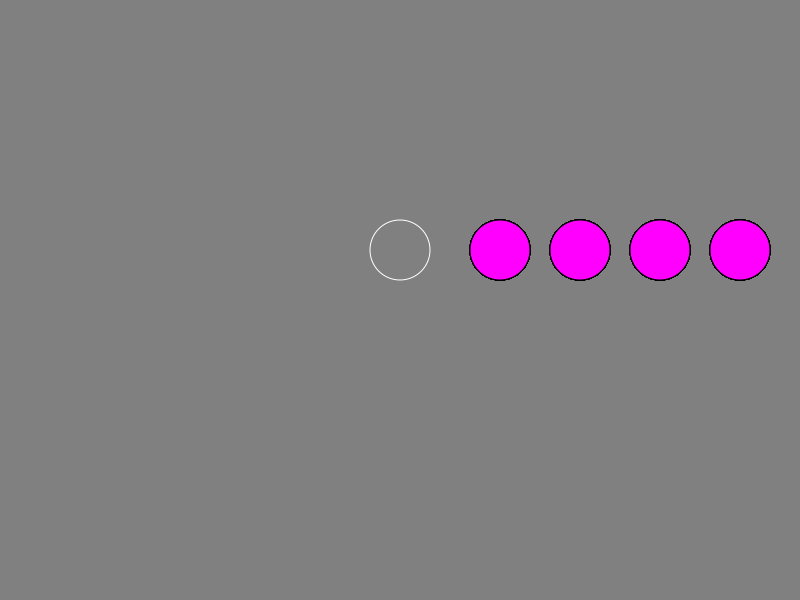

# Haskell-Animation
Created an animation using Haskell and a library provided by my lecturer. The aim of the coursework was to incorporate higher order functions and list comprehensions to create clean, concise code that does the most, in the least amount of code (less than 35 lines!)

